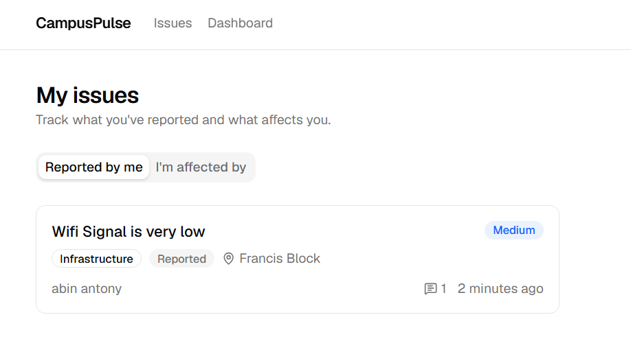
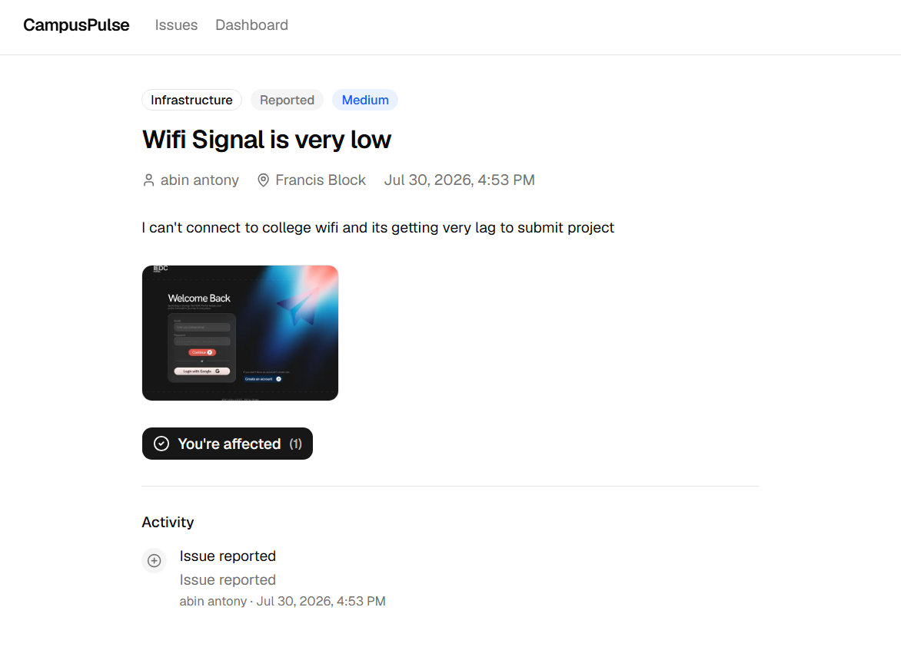
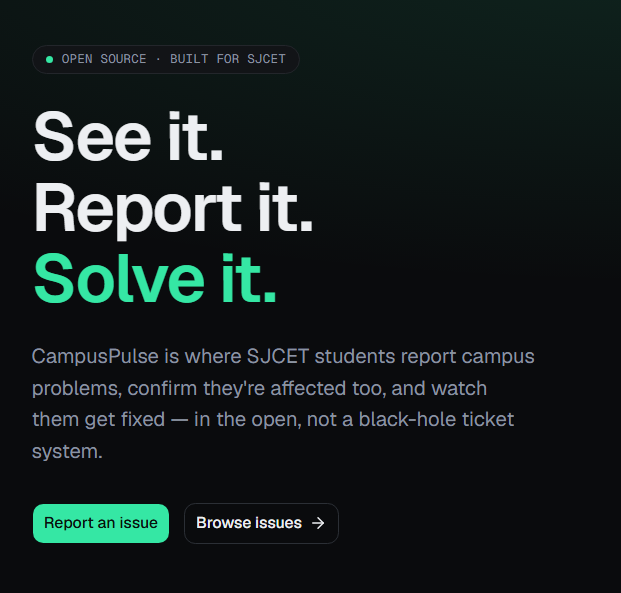

<div align="center">

# CampusPulse SJCET

### See it. Report it. Solve it.

**A full-stack platform for reporting, tracking, and resolving campus issues for SJCET.**

---
Don't Mind. this readme is made by chatgpt, But the code and ideas are all mine :)
---
[](https://nextjs.org/)
[](https://hono.dev/)
[](https://supabase.com/)
[](https://www.postgresql.org/)
[](https://www.docker.com/)

[🌐 Live Demo](#) • [🐛 Report Bug](../../issues) • [💡 Request Feature](../../issues)

</div>

---

## 📋 Table of Contents

- [About](#-about)
- [Features](#-features)
- [Architecture](#-architecture)
- [Technology Stack](#️-technology-stack)
- [Getting Started](#-getting-started)
- [Docker](#-docker)
- [Code Documentation](#-code-documentation)
- [Screenshots](#-screenshots)
- [Roadmap](#️-roadmap)
- [Contributing](#-contributing)
- [License](#-license)

---

## 🎯 About

**CampusPulse** lets students report campus issues, confirm problems affecting them, and track their resolution.

Admins can **prioritize, manage, and resolve issues** based on their impact.

> **See it. Report it. Solve it. ⚡**

---

## 🚀 Features

### 🎓 Student

<details>
<summary><b>View Student Features</b></summary>

<br>

- 🚨 Report campus issues
- 🔍 Search and filter reports
- 🙋 Confirm **"I'm affected too"**
- 📸 Upload issue evidence
- 🕒 Track issue activity
- 📋 View reported issues
- 🔔 Follow resolution progress
- 🌙 Dark & light mode
- 📱 Responsive interface

</details>

### 🛡️ Admin

<details>
<summary><b>View Admin Features</b></summary>

<br>

- 📊 Campus issue dashboard
- ⚡ Identify high-impact issues
- ✅ Verify reports
- 🚦 Update issue status
- 🔥 Set issue priority
- 📝 Add resolution notes
- ♻️ Reopen resolved issues
- 📈 View issue analytics
- 🕒 Full activity timeline

</details>

---

## 🧠 Architecture

CampusPulse follows a clean full-stack architecture with **Next.js** powering the application and **Hono** handling the backend.

```text
                         Client
                           │
                           ▼
                    ┌─────────────┐
                    │   Next.js   │
                    │  App Router │
                    └──────┬──────┘
                           │
                        /api/*
                           │
                           ▼
                    ┌─────────────┐
                    │    Hono     │
                    │   Backend   │
                    └──────┬──────┘
                           │
              ┌────────────┼────────────┐
              │            │            │
              ▼            ▼            ▼
           🔐 Auth      🐘 Database   📦 Storage
              │            │            │
              └────────────┼────────────┘
                           ▼
                       Supabase
```

### Request Flow

```text
Request
   ↓
Authentication
   ↓
Authorization
   ↓
Validation
   ↓
Hono
   ↓
Business Logic
   ↓
Supabase
   ↓
PostgreSQL + RLS
```

> 🔐 Authorization is enforced server-side — never trusted to the browser.

---

## 🛠️ Technology Stack

| Category | Technology |
| --- | --- |
| **Frontend** | Next.js, React, TypeScript |
| **Backend** | Hono |
| **Database** | PostgreSQL |
| **Platform** | Supabase |
| **Authentication** | Supabase Auth |
| **Storage** | Supabase Storage |
| **Validation** | Zod |
| **UI** | Tailwind CSS, shadcn/ui |
| **Security** | PostgreSQL Row Level Security |
| **Development** | Docker, Docker Compose |
| **Deployment** | Docker + Managed Supabase |

---

# 📥 Getting Started

## Prerequisites

Make sure you have installed:

- ✅ [Node.js](https://nodejs.org/) 20+
- ✅ [Git](https://git-scm.com/)
- ✅ [Docker](https://www.docker.com/)
- ✅ [Supabase CLI](https://supabase.com/docs/guides/local-development/cli/getting-started)

---

## ⚡ Installation

### 1️⃣ Clone the Repository

```bash
git clone https://github.com/YOUR_USERNAME/campuspulse.git
cd campuspulse
```

### 2️⃣ Install Dependencies

```bash
npm install
```

### 3️⃣ Configure Environment

Copy the example environment file:

```bash
cp .env.example .env.local
```

Configure your environment (these are the actual variable names the app validates at startup — see `lib/env.server.ts` / `lib/env.client.ts`):

```env
NEXT_PUBLIC_SUPABASE_URL=
NEXT_PUBLIC_SUPABASE_PUBLISHABLE_KEY=

SUPABASE_SECRET_KEY=
SUPABASE_DB_URL=
```

> ⚠️ Never commit `.env.local` or expose server-side Supabase secrets.

### 4️⃣ Start Supabase

Make sure Docker is running.

```bash
supabase start
```

### 5️⃣ Setup Database

Apply migrations:

```bash
supabase db reset
```

Real `auth.users` can't be created through plain SQL, so seed data is a separate script that uses the Supabase Admin API instead of a `seed.sql`:

```bash
npm run db:seed
```

This creates confirmed demo accounts (3 students + 1 admin, password printed at the end) plus sample issues, confirmations, and activity across every category/status.

### 6️⃣ Start Development Server

```bash
npm run dev
```

🎉 **That's it!**

Want a scripted end-to-end rehearsal (login → report → confirm → verify → resolve → timeline) instead of clicking through manually? Run `npm run smoke` against the seeded dev server.

Open:

```text
http://localhost:3000
```

---

# 🐳 Docker

CampusPulse ships with a Docker-based development environment.

### Build & Start

```bash
docker compose up --build
```

### Run in Background

```bash
docker compose up -d
```

### View Logs

```bash
docker compose logs -f
```

### Stop

```bash
docker compose down
```

### Rebuild

```bash
docker compose build --no-cache
docker compose up
```

> Production deployment (VPS, `docker-compose.prod.yml`, managed Supabase, TLS, rollback) is documented separately in [`DEPLOYMENT.md`](./DEPLOYMENT.md).

---

# 📖 Code Documentation

## 📂 Project Structure

```text
campuspulse/
│
├── app/
│   ├── (public)/              # Public pages
│   ├── (auth)/                # Authentication pages
│   ├── dashboard/             # Student dashboard
│   ├── admin/                 # Admin dashboard
│   │
│   └── api/
│       └── [[...route]]/
│           └── route.ts       # Hono entry point
│
├── components/
│   ├── ui/                    # Shared UI components
│   ├── layout/                # Layout components
│   └── features/              # Feature components
│
├── server/
│   ├── api/index.ts            # Hono application assembly
│   ├── routes/                 # Backend routes (issues, admin, health)
│   ├── middleware/             # Auth (cookie + Bearer) & error handling
│   ├── services/                # Business logic
│   ├── repositories/            # Supabase data access (RLS-enforced)
│   ├── db/                      # Drizzle schema + client (admin analytics only)
│   └── supabase/                # Server/admin Supabase clients
│
├── lib/
│   ├── actions/                # Next.js Server Actions (auth)
│   ├── auth/                   # getCurrentProfile() session helper
│   ├── hooks/                  # Client hooks (realtime)
│   └── supabase/browser.ts     # Browser Supabase client
│
├── schemas/                     # Zod schemas (issues, admin, auth)
├── constants/                   # Categories/statuses, status-transition map, SJCET email rules
├── types/                       # Database + domain TypeScript types
│
├── supabase/
│   ├── migrations/            # Database migrations (schema, RLS, triggers, indexes — the source of truth)
│   └── config.toml
│
├── scripts/
│   ├── seed.ts                 # Demo users (Admin API) + sample data
│   └── smoke.ts                 # Scripted end-to-end demo rehearsal
│
├── tests/
│   ├── unit/                    # Vitest — schemas, transitions, role derivation
│   └── integration/             # Hono app.request() against a live Supabase instance
│
├── public/
│
├── Dockerfile
├── docker-compose.yml
├── .env.example
└── README.md
```

---

## 🧩 How the Codebase Works

<details>
<summary><b>▲ app/ — Next.js Application</b></summary>

<br>

Contains the application routes, pages, layouts, and Next.js components.

Responsible for:

- Pages & routing
- Server Components
- Client Components
- Layouts
- Loading states
- Error states
- User interface

</details>

<details>
<summary><b>🔥 server/api/ — Hono Backend</b></summary>

<br>

Contains the backend application powered by **Hono**.

Responsible for:

- Backend routing
- Authentication
- Authorization
- Request validation
- Error handling
- Response handling

The Hono application is integrated directly with Next.js.

```text
Next.js
   ↓
/api/*
   ↓
Hono
```

This keeps the project as **one deployable full-stack application**.

</details>

<details>
<summary><b>⚙️ server/services/ — Business Logic</b></summary>

<br>

Contains the core application logic.

Examples:

```text
issue-service.ts
confirmation-service.ts
admin-service.ts
analytics-service.ts
attachment-service.ts
```

The flow stays simple:

```text
Route
  ↓
Service
  ↓
Repository
  ↓
Database
```

This keeps business logic away from UI components and route handlers.

</details>

<details>
<summary><b>🗄️ server/repositories/ — Data Access</b></summary>

<br>

Contains database operations and queries.

```text
Hono
  ↓
Service
  ↓
Repository
  ↓
Supabase
  ↓
PostgreSQL
```

Keeping database access here makes the application easier to maintain and test.

</details>

<details>
<summary><b>✅ schemas/ — Validation</b></summary>

<br>

Contains shared **Zod validation schemas**.

Used for:

- Forms
- Issue creation
- Search filters
- Pagination
- Admin actions
- File uploads
- Environment validation

Frontend validation improves UX.

Server validation protects the application.

</details>

<details>
<summary><b>🐘 supabase/ — Database Infrastructure</b></summary>

<br>

Contains everything required to reproduce the database.

```text
supabase/
├── migrations/
├── seed.sql
└── config.toml
```

All database changes are managed through migrations.

Create a migration:

```bash
supabase migration new migration_name
```

Reset the local database:

```bash
supabase db reset
```

</details>

---

## 🗄️ Database Structure

The core data model stays intentionally simple.

```text
                       profiles
                           │
                           │
                        issues
                           │
              ┌────────────┼────────────┐
              │            │            │
              ▼            ▼            ▼
      confirmations     updates     attachments
```

| Table | Purpose |
| --- | --- |
| `profiles` | User profiles and roles |
| `issues` | Campus issue reports |
| `issue_confirmations` | Students affected by an issue |
| `issue_updates` | Issue activity and history |
| `attachments` | Images and issue evidence |

---

## 🔐 Security

CampusPulse uses multiple layers of security.

```text
User
 │
 ▼
Supabase Auth
 │
 ▼
Hono Middleware
 │
 ▼
Authorization
 │
 ▼
Zod Validation
 │
 ▼
Business Logic
 │
 ▼
PostgreSQL + RLS
```

### Security includes

- 🔐 Supabase Authentication
- 🛡️ PostgreSQL Row Level Security
- 👮 Server-side authorization
- ✅ Zod validation
- 🔒 Database constraints
- 📁 Controlled file uploads
- 🕒 Administrative activity tracking

> Changing a role from DevTools doesn't make you an admin. Nice try. 😌

---

# 📸 Screenshots

> Screenshots will be added as development progresses.

<!--

Place screenshots inside:

docs/screenshots/

Example:







-->

---

# 🗺️ Roadmap

### 🚧 Core

- [x] Authentication
- [x] Issue reporting
- [x] Issue feed
- [x] Search & filtering
- [x] Issue confirmations
- [x] Activity timeline
- [x] Evidence uploads
- [x] Student dashboard
- [x] Admin dashboard
- [x] Issue analytics
- [x] Row Level Security
- [x] Docker deployment
- [x] Command palette (⌘K)
- [x] Realtime confirmation/status updates

### 🔮 Future

- [ ] 🔔 Notifications
- [ ] 🧠 Duplicate issue detection
- [ ] 📱 PWA support
- [ ] 📊 Advanced analytics

---

# 🤝 Contributing

Contributions, ideas, and improvements are always welcome.

### 1️⃣ Fork the Project

Fork CampusPulse to your GitHub account.

### 2️⃣ Create a Feature Branch

```bash
git checkout -b feature/amazing-feature
```

### 3️⃣ Make Your Changes

Before pushing:

```bash
npm run lint
npm run typecheck
npm run build
```

### 4️⃣ Commit

```bash
git add .
git commit -m "feat: add amazing feature"
```

### 5️⃣ Push

```bash
git push origin feature/amazing-feature
```

### 6️⃣ Open a Pull Request 🚀

Keep your PR description simple:

- **What changed?**
- **Why was it needed?**
- **How was it tested?**

---

## 🌱 Good First Contributions

You don't need to rebuild half the project to contribute.

- 🐛 Fix bugs
- 🎨 Improve UI
- 📱 Improve responsiveness
- ♿ Improve accessibility
- ⚡ Improve performance
- 🧪 Add tests
- 📖 Improve documentation
- 💡 Suggest useful features

---

## 🧑‍💻 Development Philosophy

```text
Simple   > Complicated
Secure   > Convenient
Useful   > Flashy
Finished > Overengineered
```

> Build what solves the problem. Skip the unnecessary complexity.

---

# 💖 Support the Project

If you find CampusPulse useful:

- ⭐ **Star the repository**
- 🐛 **Report bugs**
- 💡 **Suggest features**
- 👨‍💻 **Contribute**
- 📢 **Share the project**

---

# 📄 License

This project is licensed under the **MIT License**.

See [`LICENSE`](LICENSE) for more information.

---

<div align="center">

# ⚡

### CampusPulse

**See it. Report it. Solve it.**

Built with ❤️, TypeScript, and probably too much coffee.

⭐ **Star the repo if CampusPulse caught your attention.**

</div>